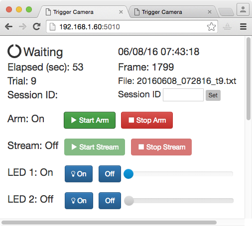
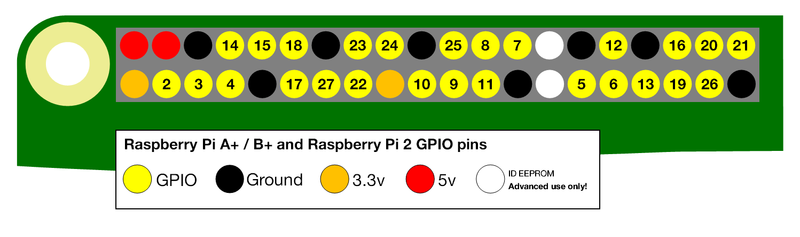

# Trigger Camera

This is documentation to construct a system with a Raspberry Pi computer that responds to general purpose digital input-output (GPIO) pulses to start and stop video acquisition during an experiment. External events such as frame times on a scanning microscope are watermarked on the video and saved to a text file. The camera can be controlled from a Python command prompt or with a web browser.

 
**Figure 1. Web-browser interface.**

Example web interface for the Trigger Camera. See [web help](/webhelp) for more information

 

# Overview

This Raspberry Pi Trigger Camera camera is designed to integrate into our [Treadmill](http://cudmore.github.io/treadmill) system. The Treadmill system is advantageous if an Arduino is needed to precisely control other pieces of equipment like LEDs, motors, or valves.

## The Raspberry Pi

The Raspberry Pi is a low cost ($35) computer that runs Linux. In addition to USB, ethernet, and HDMI connectors, the Raspberry Pi has a dedicated camera port and GPIO ports. Both the camera and GPIO ports can be easily programmed using Python. The Raspberry Pi provides an end-to-end open source system. Both the hardware and the software is provided by [The Raspberry Pi Foundation][raspberrypi.org] and is actively maintained and extended by an active developer community.

## Software implementation

The software provided here will run a Raspberry Pi camera as a slave to other devices already in place for an experiment. Once the camera is armed, it will continuously record a circular stream of video in memory. When a digital trigger is received, the the video will begin being saved to disk. In addition to saving the video after a trigger, the video before the trigger will also be saved. This has the distinct advantage of given you a record of what your animal was doing  before a trial was started. In many cases, 'bad trials' can be found because there was a lot of movement (or some other abberent event) before a trial began.

## Video resolutions and FPS

The Raspberry Pi camera has the following resolutions and FPS. Set the resolution and FPS in the [config.ini][config.ini] file. See the [PiCamera Python documentation][picamera_fov] for more information.

|		|Resolution	|Aspect Ratio	|Framerates	|Video	|Image	|FoV		|Binning
| ---	| -----		| -----			| ----- 	| -----	| -----	| ----- 	| ---
|1		|1920x1080	|16:9			|1-30fps	|x	 	|		|Partial	|None
|2		|2592x1944	|4:3			|1-15fps	|x		|x		|Full		|None
|3		|2592x1944	|4:3			|0.1666-1fps|x		|x		|Full		|None
|4		|1296x972	|4:3			|1-42fps	|x	 	|		|Full		|2x2
|5		|1296x730	|16:9			|1-49fps	|x	 	|		|Full		|2x2
|6		|640x480	|4:3			|42.1-60fps	|x	 	|		|Full		|4x4
|7		|640x480	|4:3			|60.1-90fps	|x	 	|		|Full		|4x4

## Limitations

The Raspberry Pi runs Linux and like other operating systems including Microsoft Windows and Mac OS it is not real time. There will always be unpredictable delays in the detection and generation of GPIO pulses. If the detection of a fast pulse or the timing of a pulse is critical for an experiment it is strongly suggested to use a more precise microcontroller like an Arduino.

See the [Analysis](index.md#analysis) section for example Python code to test the limits of this precision.

<!--
## TTL versus GPIO

Transistor–transistor logic (TTL) and general-purpose input/output (GPIO) are both digital lines that transmit signals by pulsing between a low level (usually 0 or ground) and a high level. Although it is actually rather complicated, the main difference between TTL and GPIO is in the high-level. Most devices with TTL input/output use a 5V high level while the Raspberry Pi GPIO uses a 3.5V high level. The Raspberry Pi 3.5V GPIO are **not** 5V tolerant. If a 5V TTL is connected directly to a Raspberry Pi 3.5V GPIO, the Raspberry Pi may be burned and no longer function. To connect a 5V TTL device to a Raspberry Pi 3.5V GPIO, the voltage needs to be shifted down to 3.5V. This is easily accomplished with a pre-made [level shifter][levelshifter] or by [hand-wiring a voltage-divider][voltagedivider].
-->

# Parts list

The total cost should be about $150. These parts are widely available at many different online sellers including: Sparkfun, Adafruit, Element14, and Amazon.

|Quatity	|Item	|Note   |Cost	|Link
| -----		| -----	| ----- | -----	| -----
|1	|Raspberry Pi 2 or 3	|Either 2 or 3 is fine	|$35-$40	|[element14](https://www.element14.com/community/community/raspberry-pi)[adafruit](https://www.adafruit.com/Raspberrypi?gclid=Cj0KEQjwjoC6BRDXuvnw4Ym2y8MBEiQACA-jWb8tCiD5TykdkpvJ184mb5AiL_k3g120xLZtVTQMQ34aAmDf8P8HAQ)
|1	|Class 10 micro SD card	|For the Rasperry system, 16 GB is fine	|$10	|[link](http://www.amazon.com/s/?ie=UTF8&keywords=micro+sd+card+16+gb+class+10&tag=hydsma-20&index=aps&hvadid=33027971211&hvpos=1t1&hvexid=&hvnetw=g&hvrand=15263061345775076871&hvpone=&hvptwo=&hvqmt=b&hvdev=c&ref=pd_sl_37w08e4zzq_b&gclid=Cj0KEQjwjoC6BRDXuvnw4Ym2y8MBEiQACA-jWRxAJiXqEdjjslWM9IhJKyxuhdX_MdYcajeVBoNtEdsaAt4w8P8HAQ)
|1	|5V 2A AC to DC power	|Make sure it is >2A and don't buy a cheap one	|$6-$8	|[link](https://www.adafruit.com/products/1995)
|1	|Pi NoIR Camera	|	|$25-$30	|[link](https://www.adafruit.com/products/3100)
|1	|Pi Camera Ribbon cable (2 meters)	|	|$6	|[link](https://www.adafruit.com/products/2144)
|1	|Pi Camera HDMI extension cable	|Optional	|$15	|[link](https://www.tindie.com/products/freto/pi-camera-hdmi-cable-extension/)
|1	|USB Memory	|To save video, 32GB or 64GB is a good starting point	|$10-$15	|[link](http://www.amazon.com/s?rh=n%3A3151491%2Cp_n_size_browse-bin%3A1259716011)
|1	|Voltage level shifter	|To convert 5V GPIO to 3.5V	|$4	|[link][levelshifter]
|4	|IR LEDS	|<900nm is best	|$0.95	|[850nm](https://www.sparkfun.com/products/9469)/[950nm](https://www.sparkfun.com/products/9349)
|4	|Resistors	|One for each IR LED	|$7 (for 500 pack)	|[link](https://www.sparkfun.com/products/10969?gclid=Cj0KEQjwjoC6BRDXuvnw4Ym2y8MBEiQACA-jWTV674jgG9mRsuvTandLS6fLJtRMrtjP72GI4fvFieAaAjWH8P8HAQ)
|1	|5V relay	|To turn higher voltages like 12V on and off	|$3	|[link](http://www.sainsmart.com/4-channel-5v-relay-module-for-pic-arm-avr-dsp-arduino-msp430-ttl-logic.html)

One option is to buy a Raspberry Pi starter kit from [Canakit][canakit]. These kits include most of the parts needed to get a fully working Raspberry Pi.

The number of IR LEDs is not critical. This will depend on how far away your subject is from the camera. Usually 4 IR LEDs is a good starting point.

# Building the system

## Configuring a Raspberry Pi

We are not going to provide a full tutorial here and will assume a functioning Raspberry Pi. Here is a basic to do list to get started.

 - [Install Raspbian on an SD card and boot the pi][installraspian]
 - [Configure wired network][configurenetwork]
 - Make sure the camera is installed
 - Install the [iPython][ipython] command line interface
 - Install required python libraries
 - [Mount a USB drive at boot][mountusb]
 - SMB to mount/share folders with Windows computers
 - AFP to mount/share folders with OS X (SMB will also work with OS X)
 - StartUpMailer to have the Raspberry Pi email with its IP address when it boots

## Choosing the triggers

There are two different trigger options. These are set in the [config.ini][config.ini] file using `useTwoTriggerPins`

 - Two trigger pins, one for triggering start/stop of video and a second for triggering frames. This is the preferred triggering system. This is used to interface with a [Bruker][bruker] microscope.
 - One trigger pin for both trigger and frames. This is used to interface with a microscope running [ScanImage][scanimage] software.
 
## Wiring the system

 - Connect camera to Raspberry Pi
 - Connect signal and ground of GPIO/TTL cables from other equipment to the Raspberry Pi (be sure to convert incoming 5V GPIO to 3.5V)
 - Connect IR LEDs to the Raspberry Pi. If LEDs need a lot of power, hook them up with a 5V relay and an external 12V power supply. See [this tutorial](http://www.raspberrypi-spy.co.uk/2012/06/control-led-using-gpio-output-pin/
 ) to wire a 5V LED to the Raspberry Pi.
 
`**Important:**` The Raspberry Pi can only accept GPIO signals at 3.5V. Many devices use 5V for GPIO/TTL signals. Thus, a level shifter is needed to convert 5V to 3.5V. It is easy to make a [voltage divider][voltagedivider] by hand or to buy a pre-made [voltage level shifter][levelshifter].

## Install required software

### Clone github repository

This will download all the neccessary code into a directory named 'triggercamera'

    git clone https://github.com/cudmore/triggercamera.git
    
### Run install script

We provide a ./install.sh script to install all required libraries. If this script fails, try installing manually.

    cd triggercamera
    ./install.sh

### Installing required Python libraries (manual)

Install libraries with apt-get

    sudo apt-get install python-dev #python development headers
    sudo apt-get install python-eventlet
    sudo apt-get install python-pandas
    sudo pip install plotly

The remaining libraries can be installed with pip.

    pip install pyserial
    pip install RPi.GPIO
    pip install picamera
    pip install ConfigParser

    pip install flask
    pip install flask-socketio

	pip install platformio #to upload code to arduino
	
## Arduino

Optional Arduino code is provided in [triggercamera/arduino][arduino_code]. This code uses an Arduino as a 'pass through' device, receiving 5V TTL pulses and passing them along to the Raspberry Pi at 3.5V (assuming an Arduino Teensy). The Arduino code will also [simulate a microscope][bSimulateScope], sending GPIO triggers for 'trial' and 'frame'.

We strongly suggest using an Arduino [Teensy][teensy]. The Teensy is (i) fast, (ii) has lots of memory, (iii) accepts 5V GPIO and outputs 3.5V, and (iv) all GPIO pins can be assigned as low level interrupts.

PlatformIO is a command line interface to compile and upload code to an Arduino. It is easy to run at the command prompt on a Raspberry Pi. See [this blog post][platformio_blog] on installing and configuring PlatformIO.

Once PlatformIO is installed and configured to talk to an Arduino, upload code to an Arduino using

    cd triggercamera/arduino/bExperiment
    platformio run --target upload

The correct serial port needs to be specified in [config.ini][config.ini]. Find the Arduinos serial port by looking for something like ttyACM0 in

	ls /dev/tty*
	
# Running the camera

## Live video output

The primary interface for controlling the camera is through the Python command prompt or a web browser. An added feature is a real-time video can be viewed on an external video monitor. This is as simple as connecting the RCA plug on the Raspberry Pi to an external video monitor (not a computer monitor). Using this live video feed does not interfere with any of the Python or web browser code that interacts with the camera to trigger and save video.

**NOTE:** The Raspberry Pi 2/3 uses a 3.5mm audio plug for both audio and composite video out. See [here](http://www.raspberrypi-spy.co.uk/2014/07/raspberry-pi-model-b-3-5mm-audiovideo-jack/).

## Python command line

The [iPython][ipython] command line interface should be used.

With [triggercamera.py][triggercamera], the camera can be controlled with a Python command line. Once the camera is armed with 'startArm()', it will start and stop video recording following GPIO triggers.

	import triggercamera
	tc = triggercamera.TriggerCamera()
	tc.startArm() #arm the camer to respond to triggers
	
	tc.stopArm() #stop the camera from responding to trigger
	
Additional interface

	#start and stop video recording as much as you like
	tc.startVideo()
	tc.stopVideo()

	# single images can be saved every few seconds while video is being recorded
	tc.doTimelapse=1
	tc.doTimelapse=0

	# todo: add interface to control two different LEDs

## Web interface

[triggercamera_app.py][triggercamera_app] provides a web server allowing the camera to be controlled through a web browser.

Run the web server with

    python triggercamera_app.py

Then, bring up the web page from a browser (we suggest Chrome) using the IP address of the Raspberry and port 5010

    http://192.168.1.60:5010

Additional documentation on using this web interface is in the [web help](/webhelp) page.

### Streaming video in the web interface

Optionally, real-time video can be streamed from the camera to the web interface. This requires [uv4l][uv4l] to be installed. See [this blog post][uv4l_blog] to install uv4l on a Raspberry Pi.

### REST Interface

In addition to the point and click web interface, the web server provides a [REST][rest] interface that can be remotely scripted using a set of web addresses.

    http://192.168.1.12:5010/startarm
    http://192.168.1.12:5010/stoparm
    http://192.168.1.12:5010/startvideo
    http://192.168.1.12:5010/stopvideo
    http://192.168.1.12:5010/timelapseon
    http://192.168.1.12:5010/timelapseoff
    http://192.168.1.12:5010/lastimage

### Client side code

The web server is running in Python on the raspberry Pi. When a web page is served to a client, the interface is provided using a large collection of client-side code written in [JavaScript][javascript].

- [Socket-io][socketio] allows the Flask server to push updates to web-page without reloading the page
- [Bootstrap][bootstrap] for page layout, buttons, sliders, value display
- [jquery][jquery] to handle logic of user interface
- [plotly.js][plotly] to plot the arduino stimulus
- [highcharts.js][highcharts] to plot a trial in real-time while it is running (only used in treadmilll)
- [jqgrid][jqgrid] to display a table of trials from disk

<!--
## LCD and keypad interface

**NOT IMPLEMENTED.** A hardware interface is provided if an [LCD/keypad][lcdkeypad] is attached to the Raspberry Pi.
-->

# User configuration

Modify [config.ini][config.ini] and restart the camera code

	[serial]
	useSerial: True
	port: /dev/ttyACM0
	baud: 9600

	[system]
	savepath: /video

	watchedpathon: False
	watchedpath: ''

	[triggers]
	useTwoTriggerPins: 1
	triggerpin: 27
	framepin: 17

	[led]
	ledpin1: 2
	ledpin2: 3

	[camera]
	fps: 30
	resolution: 640,480
	bufferSeconds = 5

	[simulatescope]
	on: 1
	initialDelay: 1
	frameInterval: 30
	frameNumber: 300

# Output video

Video is saved in the [h264][h264] video format. This is a very efficient video codec that make very small but highly detailed videos. Before these h264 video files can be analyzed, they need to be converted to include the frames per second. This can be done in a number of video editing programs. One way to do this conversion is by using the command line program [ffmpeg][ffmpeg]. Because ffmpeg can be scripted, it is easy to incorporated into most workflows. The status of ffmpeg on the Pi is confusing. Here, we use a fork (or a nasty illegal fork?) called avconv.

Install avconv

	sudo apt-get install libav-tools 
	
Convert one .h264 file

	avconv -r 30 -i 20160604_181119_after.h264 -vcodec copy 20160604_181119_after.mp4

Pseudocode to convert a directory of .h264 files
	
    srcDir = '/src/dir/with/video/'
    dstDir = 'dst/dir/for/mp4/'
    for file in srcDir:
        outfile = file.strip('.h264') + '.mp4'
        avconv -r 25 -i file -vcodec copy dstDir+outfile

# Output files

Each time the camera is triggered to save video, a .txt file with frame times is also saved.

Here are the first 5 frames of an output .txt file. The first line is a header, second line gives column names, third line is start of data.

	date=20160606,time=223717,trial=1,fps=30,width=640,height=480,numFrames=1799,ardFrames=0
	date,time,seconds,event,frameNumber
	20160606,223623,1465266983.09,startVideo,
	20160606,223623,1465266983.12,numFrames,1
	20160606,223623,1465266983.15,numFrames,2
	20160606,223623,1465266983.18,numFrames,3
	20160606,223623,1465266983.21,numFrames,4
	20160606,223623,1465266983.24,numFrames,5

# Analysis

## Analyzing output .txt files

We have provided Python code to load, analyze and plot the output .txt files. See [an example iPython notebook][analysis.ipynb]. Because the Raspberry Pi is not configured with a keyboard/mouse/monitor, this code can be run on a different machine using an iPython notebook.

Bring up an iPython web interface

    # if your Raspberry Pi is on the network at 'pi60'
    cd /Volumes/pi60/triggercamera/analysis/
    ipython notebook

Here is an analysis of the frame interval detected by the Raspberry Pi and a good example of some of the limitations. Using [/arduino/bExperiment/src/bExperiment.cpp][arduino_code] an Arduino output a frame pulse every 30 ms.

In general, the Raspberry Pi does not miss frames but  can occasionally detect frames late. The performance of the Pi can be degraded if additional software is run on the Pi. In general, keep it minimal.
 

## Analyzing video

We will provide Python code using [OpenCV][opencv] to load and browse video files.

# Add ons

By creating a system with a Raspberry Pi there are a large number of ways to quickly and cheaply extend the system in very useful ways.

 - [Done] Add an Arduino microcontroller
 - Add an LCD/button controller
 - Add a touch-screen interface
 
# Troubleshooting

 - Test the camera with

    raspistill -o tst.jpg

 - If the camera triggering is erratic or the Raspberry is missing fast pulses, check that all digital lines going to the Raspberry Pi are grounded. It is good practice to connect the Raspberry Pi ground pins to the ground (shield) of any digital lines.

 - If the recorded video changes light-levels erratically, this is usllay due to fluctuations in the power to the Pi. Make sure the Pi has a DC power supply >2 Amps. If additional LEDs are being powered by the Pi, consider breaking these out with their own dedicated power supplies.

 - See [this](http://raspberrypi.stackexchange.com/questions/34444/cant-get-a-cifs-network-drive-to-mount-on-boot) to auto mount an SMB share on boot

   

# To Do
 - **Done:** Implement a Flask homepage to provide buttons to control camera and feedback during a trial.
 - **Done:** Add control and interface for two LEDs (e.g. IR and white).
 - **Done:** Add a header to output files #fps=xxx;width=xxx;height=xxx
 - Write a Python script to batch process a folder of .h264 into .mp4 (with fps)
 - Write a python video browser using Open-CV.
 - **Will not do this:** try using easydict so i can use'.' notation in code
 - Add a physical emergency 'stop' button
 
 
[raspberrypi.org]: https://www.raspberrypi.org
[piicamera]: http://picamera.readthedocs.io/en/release-1.10/
[configparser]: https://docs.python.org/2/library/configparser.html
[flask]: http://flask.pocoo.org
[flask socketio]: http://flask-socketio.readthedocs.io/en/latest/

[lcdkeypad]: https://learn.adafruit.com/adafruit-16x2-character-lcd-plus-keypad-for-raspberry-pi

[config.ini]: https://github.com/cudmore/triggercamera/blob/master/config.ini
[triggercamera]: https://github.com/cudmore/triggercamera/blob/master/triggercamera.py
[triggercamera_app]: https://github.com/cudmore/triggercamera/blob/master/triggercamera_app.py

[analysis.ipynb]: https://github.com/cudmore/triggercamera/blob/master/analysis/analysis_v1.ipynb
[analysis]: https://github.com/cudmore/triggercamera/tree/master/analysis
[ffmpeg]: https://ffmpeg.org
[h264]: https://en.wikipedia.org/wiki/H.264/MPEG-4_AVC
[voltagedivider]: https://learn.sparkfun.com/tutorials/voltage-dividers
[canakit]: http://www.canakit.com
[ipython]: http://www.ipython.org
[opencv]: http://opencv.org
[levelshifter]: https://www.adafruit.com/product/757
[bruker]: https://www.bruker.com/products/fluorescence-microscopes/ultima-multiphoton-microscopy.html
[scanimage]: http://scanimage.vidriotechnologies.com/pages/viewpage.action?pageId=361641

[installraspian]: http://blog.cudmore.io/post/2015/03/21/fresh-install-raspian/
[configurenetwork]: http://blog.cudmore.io/post/2015/12/05/raspberry-wifi/
[mountusb]: http://blog.cudmore.io/post/2015/05/05/mounting-a-usb-drive-at-boot/

[testing_v2]: https://github.com/cudmore/triggercamera/blob/master/arduino/v2/src/v2.cpp

[picamera_fov]: http://picamera.readthedocs.io/en/release-1.10/fov.html

[arduino_code]: https://github.com/cudmore/triggercamera/tree/master/arduino/bExperiment
[bSimulateScope]: https://github.com/cudmore/triggercamera/blob/master/arduino/bExperiment/lib/bSimulateScope/bSimulateScope.h
[uv4l]: http://www.linux-projects.org/modules/sections/index.php?op=viewarticle&artid=14
[uv4l_blog]: http://blog.cudmore.io/post/2016/06/05/uv4l-on-Raspberry-Pi/
[platformio_blog]: http://blog.cudmore.io/post/2016/02/07/platformio/
[teensy]: https://www.pjrc.com/store/teensy3.html
[rest]: https://en.wikipedia.org/wiki/Representational_state_transfer

[bootstrap]: http://getbootstrap.com
[socketio]: https://flask-socketio.readthedocs.org/en/latest/
[plotly]: https://plot.ly/javascript/
[highcharts]: http://www.highcharts.com
[jqgrid]: http://www.trirand.com/blog/
[jquery]: https://jquery.com
[javascript]: https://www.javascript.com