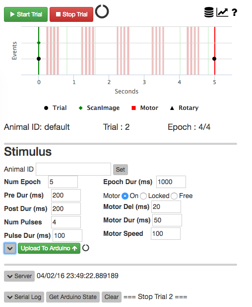
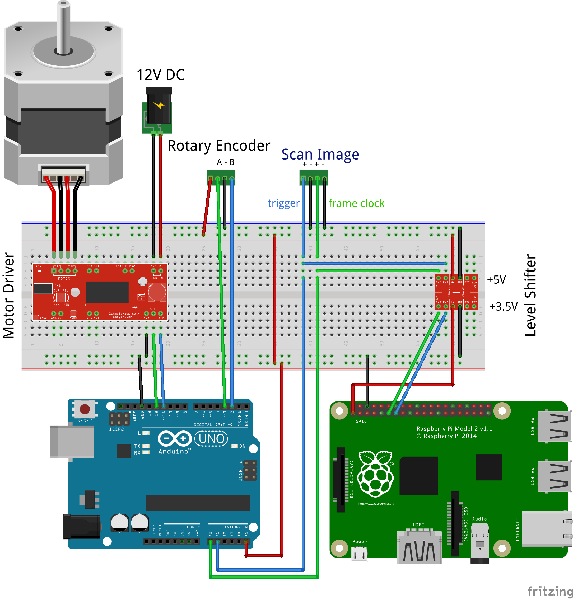

# Introduction

This is documentation for controlling a behavioral experiment using an Arduino microcontroller using Python. The experiment can be controlled from a Python command line or with an easy to use web browser interface. Included in this system is an option to simultaneously record video using a Rapsberry Pi video camera. Our goal is to provide a starting point for open-source behavioral experiments that can be extended to new experimental designs.

<a name="webinterface"></a>


**Figure 1. Web-browser interface.**

The top section provides an interface to start/stop a trial and plots real-time feedback as the trial is running.

The **Stimulus** section provides an interface to set stimulus parameters and to upload these parameters to an Arduino. This section also provides a plot of the stimulus waveform based on the current set of parameters.

<BR CLEAR="ALL"/>

##  System design

The core system consists of an Arduino, a stepper motor and motor driver, and a rotary encoder. The system comes together with a circular [treadmill](images.md) that can be driven by the stepper motor and whos current position is read using the rotary encoder.

The Arduino can be controlled with serial commands and can be triggered with general purpose digital input-output (GPIO) pulses. By relying on serial commands and GPIO pulses, this system is not dependent on the details of other pieces of equipment already in place for an experiment and can be extended to new and unique experimental configurations.

Using the provided Python code, an experiment can be controlled from a Python command prompt or a web browser interface. The python code will run on any computer (Windows, Mac, Linux) where Python is installed. Because of its low price, small footprint, GPIO pins, and dedicated camera we strongly suggest running all the Python code on a Raspberry Pi.


Optionally, if this code is run on a Raspberry Pi, we provide Python code to simultaneously trigger and time-stamp video recording during an experiment. Please see the [Trigger Camera][triggercamera] documentation for a full description of how to integrate video recording into this system.

We are routinely using this treadmill and video aquisition system while simultaneously acquiring in vivo two-photon images using ScanImage software (in Matlab) with National Instruments data acquisition cards.

See the [parts list](parts.md) for a full list of parts, prices, and links to buy online.

### Arduino

The majority of Arduino compatible micro-controllers will work with the code provided. We suggest starting with an Arduino [Uno][35]. A good alternative Arduino compatible microcontroller is the [Teensy][49]. The Teensy is advantageous as it has a more powerful processor, provides more low level interrupts, and has more memory than an Arduino Uno.

### Raspberry Pi

The [Raspberry Pi][38] is a fully functional credit-card sized computer that runs Linux. It comes with USB, Ethernet, Wifi, and HDMI ports. It can be used as a host computer to program an Arduino using the Arduino IDE and can easily run Python code. A unique feature of the Pi is that it has built in digital GPIO. Thus, a Raspberry Pi can send/receive GPIO signals to/from most laboratory equipment including an Arduino. The Pi can be equipped with a dedicated video camera (5MP or 8MP) that can be controlled from Python and can be (relatively) precisely triggered by GPIO pulses. Given its small footprint, a Raspberry Pi is easily integrated into the same electronics box as the Arduino.

Please note, the GPIO ports on the Rapsberry Pi are only 3.5V tolerant while most laboratory equipment (including many Arduinos and National Instruments boards) use 5V GPIO. Thus, a logic-level converter is needed to convert between 3.5V on the Pi to 5V on other equipment.

As the Raspberry Pi is running a full Linux operating system, the precision and reliability of the GPIO pins is lower than can be achieved using a dedicated microcontroller like an Arduino. Thus, we have built this system using a Teensy microcontroller as a 'pass through' device to record the precise timing of experimental events to then be compared to and to calibrate the performance of the Raspberry Pi. 

###  Wiring the system

- Wire the stepper motor to the [Easy Driver](https://www.sparkfun.com/products/12779?_ga=1.168973987.329987807.1391311484) motor driver and the Easy Driver motor driver to the Arduino
    - See Sparkun [Easy driver hook-up guide](https://learn.sparkfun.com/tutorials/easy-driver-hook-up-guide)
    - See Sparkfun [Stepper motor quickstart](https://www.sparkfun.com/tutorials/400)

- Wire the rotary encoder to the Arduino
    - See the PJRC [Encoder Library Tutorial](https://www.pjrc.com/teensy/td_libs_Encoder.html)
    
- Wire the Arduino to existing lab equipment
    - Wire the signal of each TTL line to an Arduino GPIO pin and wire the TTL line ground to the Arduino ground.
    
- Wire the Raspberry Pi to the Arduino.
    - Wire GPIO pins for 'trigger' and 'frame clock' from Arduino to Raspberry Pi
    - Wire a ground pin from the Arduino to a ground pin on the Raspberry Pi
    
Here, we are wiring the system to interact with ScanImage software via National Instruments DAQ boards. This can easily be modified by wiring the system to other in-place acquisition systems such as those from Scientifica, Bruger (Prarie), Zeiss, or Nikon.

Keep in mind, the Raspberry Pi GPIO pins are **not** 5V tolerant. Use a 5V to 3.5V level shifter to wire the Raspberry Pi to 5V GPIO signals. A Teensy microcontroller is advantageous in that it will accept 5V GPIO input but only outputs 3.5V GPIO. Thus, a Teensy and Raspberry Pi GPIO pins can be directly wired without a level shifter.

Remember, all devices **must have ground pins connected to each other**, this is easy to forget. In this setup, the ground pins on the following devices all need to be wired together (i) the stepper motor driver, (ii) the Arduino and (iii) the Raspberry Pi. A good strategy is to wire a ground pin of each device to one ground rail on a breadboard.

<A HREF="img/treadmill_bb.png"></A>

### Treadmill

See the [images](images.md) page and the [treadmill section](parts.md#treadmill) of the parts list.

Building the treamill is easy but finding the pieces to build with can be time-consuming and frustrating. A good starting point is to use **Actobotics** parts from [ServoCity][13] or [Sparkfun][14]. In particular, [ServoCity][15], has made a useful set of visual guides and project ideas that are really helpful in designing hardware components. Structural components include: frames, rods, bearings, clamps, and motor mounts.

## Upload code to the Arduino

The source code for the Arduino can be found in [/arduino/src/treadmill.cpp][4].

###  Required libraries

Non-blocking Arduino libraries need to be used, otherwise the system will not perform well. Without non-blocking libraries, the code to turn the stepper motor will block other code like reading the rotary encoder and vica versa. Using these non-blocking libraries ensures that (but do not gaurantee) the stepper motor movement does not stutter and all the rotary encoder positions are logged.

- [AccelStepper][16] library to control stepper motor
- Rotary encoder library from [PJRC][17]

###  Arduino IDE

Use the standard [Arduino IDE][arduinoide] to upload [treadmill.cpp][4] to an Arduino. Make sure the required Arduino libraries are installed. Be sure to activate additional [low level interrupts](index.md#lowlevelinterrupts) if using an Arduino Uno.

### Platformio

Code can also be uploaded to an Arduino using [PlatformIo][5]. This has the distinct advantage that code can be compiled and uploaded from the command line on a headless computer including a Raspberry Pi. Please see this blog post to Install PlatformIO, compile code and upload it to an Arduino.

<a name="lowlevelinterrupts"></a>
### Low Level Interrupts

The Arduino Uno only comes with two pins (2 and 3) capable of low-level interrupts and more pins need to be enabled. Two low level interrupts are needed for the Rotary Encoder, another for a GPIO trigger, and another for GPIO pulses coming from a frame clock. See [Pin-change interrupts][25] for information on exposing additional pins as low-level interrupts.

We have included a compiler directive `_expose_interrupts_` in the [treadmill.cpp][4] Arduino code that, if activated, will run code to expose the needed interrupts on an Arduino Uno.

- If using PlatformIO, this is taken care of in the [env] section of platformio.ini
- If using the arduino IDE, `define _expose_interrupts_ = 1` must be included in [treadmill.cpp][4]

```
//Uncomment this line if running on an Arduino Uno and compiling with the arduino IDE
//#define _expose_interrupts_ 1
```

## Python server setup

Download and install [Anaconda][1]. Anaconda is a [python][2] installation that will install many commonly used libraries. It is much easier to get started with Anaconda rather than a basic installation of Python.

###  Python libraries

Install additional required python libraries using `pip install xxx` where xxx is the name of the library. Alternatively, use the included requirements.txt file.

`pip install -r requirements.txt`

Here is the requirements.txt file

```
eventlet>=0.18.4
Flask>=0.10.1
Flask-Markdown>=0.3
Flask-SocketIO>=1.0
platformio>=2.8.5
plotly>=1.9.6
pyserial>=3.0.1
pandas
```

Required python libraries to use the Raspberry Pi camera

`pip install -r raspberry_requirements.txt`

```
picamera
RPi.GPIO
```

If running Python code on a Raspberry Pi (with or without the Raspberry Camera), pandas must be installed as follows

    sudo apt-get install python-pandas

## Running an experiment

At its core, an experiment is run on an Arduino by interacting with [treadmill.cpp][4] through a serial port interface. In addition, a Python command line interface and a web based interface are provided.

These interfaces can be extended by directly interacting with the Arduino code in [treadmill.cpp][4] (with serial commands), the python code in [treadmill.py][19], or the web server code in [treadmill_app.py][18].

###  Arduino serial interface

The Arduino code [treadmill.cpp][4] provides a set of serial port commands to get/set parameters and start/stop a trial. Once the code is uploaded to an Arduino, any serial port interface will allow control of an experiment as follows.

```
startTrial # start a trial
stopTrial # stop a trial
getState #
settrial,[name],[value]
```

`settrial` takes the `name` and `value` of a trial parameter to set. The `name` needs to be one of: numPulse, numEpoch, epochDur, preDur, etc. These names match the 'Stimulus' parameters provided in the web interface. See the SetTrial() function in [treadmill.cpp][4] for all possible trial parameters.

Entering `getState` in a serial port interface and the Arduino will return the current values for all trial parameters. This is a good way to find the names of trial parameters and then set them. For example, `settrial,epochDur,5000`.

```
=== Arduino State ===
trialNumber=0
trialDur=1000
numEpoch=1
epochDur=1000
preDur=1000
postDur=1000
numPulse=3
pulseDur=1000
useMotor=1
motorDel=200
motorDur=200
motorSpeed=0
motorMaxSpeed=0
versionStr=20160322
=== Done ===
```

###  Python interface

An experiment can be controlled from within Python by interacting with [treadmill.py][19]. This includes interaction from a Python command line interface, a [iPython/Jupyter][47] interface, or custom written Python scripts. The Python interface and Arduino interface share all trial parameter names.

Here is an example of running an experiment from a Python script.
 
```python
import treadmill
t = treadmill.treadmill() # create a treadmill object

t.startTrial() # start a new trial
t.stopTrial() # stop a trial

t.GetArduinoState() # get the current state with all trial parameters (see Arduino getstate serial command).
t.settrial('epochDur',5000) # set the value of 'epochDur' trial parameter to 5000 ms

t.startTrial() # start a new trial
```

###  Web interface

An experiment can also be controlled through a web browser interface. Run the web interface with `python treadmill_app.py`. The code for this web interface, in [treadmill_app.py][18], uses the [Flask][26] Python library. Flask is a micro-framework that allows a web-server to be created and controlled all from within Python. To make the web client interactive, we use SocketIO to communicate between the web client and the Flask python server.

#### Configuring the web interface

Change the default IP address and port of the web server in [treadmill_app.py][18].

 - To run the web server on the machines local network IP, port 5010

    >socketio.run(app, host='0.0.0.0', port=5010, use_reloader=True)

 - To run the web server on localhost 127.0.0.1:5010, use this if using a single machine (no LAN needed)

    >socketio.run(app, host='', port=5010, use_reloader=True)

#### Client side

The [web interface](index.md#webinterface) is using a number of client and server libraries. See [index.html][33] and [analysis2.html][34] for client-side code.

- [Socket-io][28] allows the Flask server to push updates to web-page without reloading the page
- [Bootstrap][27] for page layout, buttons, sliders, value display
- [jquery][32] to handle logic of user interface
- [plotly.js][29] to plot the arduino stimulus
- [highcharts.js][30] to plot a trial in real-time while it is running
- [jqgrid][31] to display a table of trials from disk

## Conlusion

We have provided a description of all the pieces necessary to construct a system to control an experiment using an Arduino from Python. By creating this system with open-source hardware and software, our aim is to lower the barrier of entry to get started with implementing custom built experiments.

[1]: https://www.continuum.io/why-anaconda
[2]: http://www.python.org/

[3]:https://github.com/cudmore/treadmill/blob/master/requirements.txt
[4]: https://github.com/cudmore/treadmill/blob/master/arduino/src/treadmill.cpp
[5]: http://platformio.org/
[6]: http://docs.platformio.org/en/latest/quickstart.html#initialize-project

[7]: https://www.sparkfun.com/products/9238
[8]: https://www.sparkfun.com/products/12779
[9]: http://www.schmalzhaus.com/EasyDriver/
[10]: http://www.digikey.com/product-detail/en/600128CBL/600CS-ND/53504
[11]: http://sensing.honeywell.com/600%20series_005940-2-en_final_12sep12.pdf
[12]: https://www.sparkfun.com/products/9469
[13]: https://www.servocity.com/html/actoboticstm.html
[14]: https://www.sparkfun.com/actobotics
[15]: https://www.servocity.com/html/actoboticstm.html
[16]: http://www.airspayce.com/mikem/arduino/AccelStepper/classAccelStepper.html
[17]: https://www.pjrc.com/teensy/td_libs_Encoder.html

[18]: https://github.com/cudmore/treadmill/blob/master/treadmill_app.py
[19]: https://github.com/cudmore/treadmill/blob/master/treadmill.py

[20]: https://flask-socketio.readthedocs.org/en/latest/
[21]: http://eventlet.net/
[22]: https://pythonhosted.org/pyserial/shortintro.html
[23]: https://pythonhosted.org/Flask-Markdown/
[24]: http://docs.platformio.org/en/latest/userguide/cmd_serialports.html#platformio-serialports-monitor
[25]: http://www.geertlangereis.nl/Electronics/Pin_Change_Interrupts/PinChange_en.html
[26]: http://flask.pocoo.org

[27]: http://getbootstrap.com
[28]: https://flask-socketio.readthedocs.org/en/latest/
[29]: https://plot.ly/javascript/
[30]: http://www.highcharts.com
[31]: http://www.trirand.com/blog/
[32]: https://jquery.com
[33]: https://github.com/cudmore/treadmill/blob/master/templates/index.html
[34]: https://github.com/cudmore/treadmill/blob/master/templates/analysis2.html
[35]: https://www.arduino.cc/en/main/arduinoBoardUno
[36]: https://www.sparkfun.com/products/11021
[37]: https://www.adafruit.com/products/50
[38]: https://www.raspberrypi.org/products/
[39]: https://www.adafruit.com/category/105
[40]: https://www.element14.com/community/community/raspberry-pi
[41]: https://www.sparkfun.com/products/12009
[42]: https://www.adafruit.com/products/757
[43]: https://www.raspberrypi.org/products/pi-noir-camera/
[44]: https://www.adafruit.com/product/1567
[45]: https://www.element14.com/community/search.jspa?q=pi+noir
[46]: https://github.com/cudmore/treadmill/blob/master/VideoServer.py
[47]: https://ipython.org
[48]: https://www.arduino.cc/en/Main/arduinoBoardMega2560
[49]: https://www.pjrc.com/store/teensy32.html

[arduinoide]: https://www.arduino.cc/en/Main/Software
[triggercamera]: http://cudmore.github.io/triggercamera
